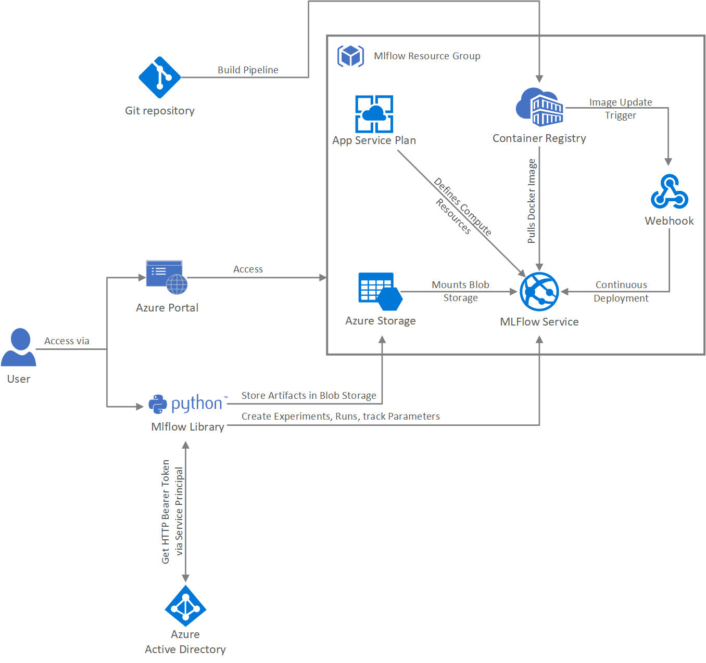

# 1. MLflow Tracking Server Docker Container and Deployment on Azure Web App for Containers (Linux)
This project can be used to deploy the MLflow Tracking Server (version 1.5.0) in a Docker container locally or on Azure. More precisely, it can be used to deploy the Docker image on an Azure Web App, where you will probably also host other services or your ML or DL models.

# 2. Features of Deployment
The deployment has the following features:
* Persistent storage across several instances and across restarts
* All data is saved in a single storage account: Blob for artifacts and file share for metrics
* All application settings are accessible via the Azure Portal and can be adjusted on the fly
* Docker image supports SSH connection only within the Azure portal (Enterprise ready security)
* Docker image is stored in private container registry (Azure Container Registry)
* Detailed logs for the MLflow tracking server or the Azure Web App 
* Optional: Continuous Integration and Continuous Deployment (CI/CD)
* Optional: Azure AD Integration

# 3. Local deployment
If you want to test the Docker container locally, then please follow these steps:

1. Install [Docker](https://docs.docker.com/) on your machine.
2. Clone the project to your local machine and unpack the zip file.
3. Open your terminal or command line and navigate to the unpacked folder (navigate to the `docker` folder of this project).
3. Build the Docker image with the following command: `docker build -t <your-docker-container-name> -f Dockerfile . --no-cache`
4. Deploy a storage account in your Azure subscription and create a container in the blob storage.
5. Write down the storage account name (`<storage-account>`), the storage connection string (`<connection-string>`) and the name of the blob container (`<blob-container>`).
6. Once the build was successful and the storage account has been created you can run the Docker image with the following command: `docker run -p 5000:5000 --env MLFLOW_SERVER_DEFAULT_ARTIFACT_ROOT=wasbs://<blob-container>@<storage-account>.blob.core.windows.net/mlartefacts --env AZURE_STORAGE_CONNECTION_STRING==<connection-string> -it <your-docker-container-name>:latest`
7. Open the MLflow hub by visiting: https://localhost:5000 (On Windows, do not open https://0.0.0.0:5000 as shown in the command line)

# 4. Deployment on Azure Web App for Containers (Linux)
## 4.1 Initial Deployment
If you want to deploy the MLflow tracking server on an Azure Web App for Containers (Linux), then please follow these steps:

0. NOTE: On Windows you can also use the Windows subsystem for Linux (WSL) for the deployment.
1. Clone the project to your local machine and unpack the zip file.
2. Open your terminal and navigate to the unpacked folder (navigate to the main folder of this project).
3. Open `deploy.sh` and adjust some settings, if required.
    - `RG_NAME` = name of the resource group to which the resources will be deployed
    - `RG_LOCATION` = location that is used for deployment of the resources
    - `ACR_NAME` = name of the Azure Container Registry (ACR)
    - `DOCKER_IMAGE_NAME` = name of the Docker image
    - `DOCKER_IMAGE_TAG` = tag of the Docker image
    - `ASP_NAME` = name of the Azure App Service Plan
    - `WEB_APP_NAME` = name of the Azure Web App
    - `MLFLOW_HOST` = host variable for the MLflow tracking server
    - `MLFLOW_PORT` = port variable for the MLflow tracking server
    - `MLFLOW_WORKERS` = workers variable for the MLflow tracking server
    - `MLFLOW_FILESTORE` = backend-store-uri variable for the MLflow tracking server (should be a folder within the `STORAGE_MOUNT_POINT`)
    - `STORAGE_ACCOUNT_NAME` = name of the storage account that is used for storing data (artifacts + parameters and variables)
    - `STORAGE_CONTAINER_NAME` = name of the blob container in the storage account
    - `STORAGE_MOUNT_POINT` = mount point of the blob container in the web app
    - `STORAGE_FILE_SHARE_NAME` = name of the file share in the storage account
    - `STORAGE_FILE_SHARE_SIZE` = reserved size of the file share in GB

NOTE: Azure Active Directory Authentication cannot be automated via Azure CLI, because the secret key is not submitted. Due to this, I will explain later in this tutorial how to activate this feature manually. Once this can be automated, you can use the commands from line 180 to 201 in `deploy.sh` to automate this process. This processs requires the following parameters:
    -  `AAD_ISSUER_URL` = issuer URL of your AAD (Use this tutorial to find the variable of your AAD: https://docs.microsoft.com/en-us/azure/app-service/configure-authentication-provider-aad#-configure-with-advanced-settings)
    - `SP_NAME` = name of the service principal 
5. Install [Azure CLI](https://docs.microsoft.com/en-us/cli/azure/install-azure-cli?view=azure-cli-latest)
6. Open your terminal and login into azure CLI:
    - Run `az login` to login to Azure.
    - Run `az account set -s <subscription-id>` to set the target azure subscription.
7. Run `./deploy.sh` and wait for the deployment to finish.
8. Once the execution of the script finishes you can check the deployed resources in the [Azure Portal](https://portal.azure.com). Open `Resource Groups` and click on the resource group with the name of the variable `RG_NAME`. The resource group should include the following resources: Azure App Service, Azure App Service Plan, Azure Container Registry and an Azure Storage Account.
9. Open `https://<WEB_APP_NAME>.azurewebsites.net` (Insert value of your variable `WEB_APP_NAME` in the URL) and check whether your service works as expected.

## 4.2 Enable CI/CD
NOTE: Due to a bug in a previous version of Azure CLI, this could not be automated. Due to an update, this can be fully automated and is already included in `deploy.sh` (line 119 to 125). Just for completeness these steps will explain you how you can achieve this manually:

1. Open the [Azure Portal](https://portal.azure.com) and navigate to your resource group with the name of the variable `RG_NAME`.
2. Click on your Web APP, which should have the name of the variable `WEB_APP_NAME`.
3. Follow the steps in this tutorial to enable CI/CD: https://docs.microsoft.com/en-us/azure/app-service/containers/app-service-linux-ci-cd#enable-continuous-deployment-with-acr

## 4.3 Enable AAD Integration
1. Open the [Azure Portal](https://portal.azure.com) and navigate to your resource group with the name of the variable `RG_NAME`.
2. Click on your Web APP, which should have the name of the variable `WEB_APP_NAME`.
3. Follow the steps in this tutorial to enable AAD Integration: https://docs.microsoft.com/en-us/azure/app-service/configure-authentication-provider-aad
4. IMPORTANT: Save the secret, client ID and tenant ID of the Service Principal in a Notepad, because this is needed when using the MLflow library. You can also generate additional keys for your service principal. More on that can be found here: https://docs.microsoft.com/en-us/azure/active-directory/develop/howto-create-service-principal-portal#get-values-for-signing-in

## 4.4 Use MLflow library with AAD enabled MLflow service
The samples show how to authenticate with the MLflow library against the tracking server with AAD authentication enabled.

1. Take note of the secret (`KEY`), client ID (`CLIENT`) and tenant ID (`TENANT_ID`) of your service principal.
2. Take note of the tracking URI of your MLflow server (`TRACKING_URI`). This URI should look like `https://<WEB_APP_NAME>.azurewebsites.net` (https://localhost:5000 in case of local deployment).
3. Take note of the connection string (`AZURE_STORAGE_CONNECTION_STRING`) of your storage account with the name of the variable `STORAGE_ACCOUNT_NAME`.
4. Navigate to the `test` folder of this project.
5. Open one of the provided examples `test.py` or `test_with_model.py`.
6. Insert the values in the selected example:
    - `TENANT_ID`: Insert your service principal tenant ID into the placeholder `<tenant-id>`.
    - `CLIENT`: Insert your service principal client ID into the placeholder `<client-id>`.
    - `KEY`: Insert your service principal secret into the placeholder `<secret>`.
    - `AZURE_STORAGE_CONNECTION_STRING`: Insert your connection string into the placeholder `<connection-string>`.
    - `TRACKING_URI`: Insert the tracking URI into the placeholder `<tracking-uri>`.
    - `EXPERIMENT_NAME`: Choose an experiment name.
5. Run the python file.
6. Open you MLflow tracking server URI and view the logged run, values and artifacts.

## 4.5 SSH to Docker Container
1. Open the [Azure Portal](https://portal.azure.com) and navigate to your resource group with the name of the variable `RG_NAME`.
2. Click on your Web APP, which should have the name of the variable `WEB_APP_NAME`.
3. Select `Development Tools` > `SSH`.
4. Alternatively follow these instructions: https://docs.microsoft.com/en-us/azure/app-service/containers/app-service-linux-ssh-support#open-ssh-session-in-browser

## 4.6 Monitor app
1. Open the [Azure Portal](https://portal.azure.com) and navigate to your resource group with the name of the variable `RG_NAME`.
2. Click on your Web APP, which should have the name of the variable `WEB_APP_NAME`.
3. Select `Diagnose and solve problems`.

# DEPRECATED: Deployment on Azure Kubernetes Service
Please open the branch [aks-deployment](https://github.com/marvinbuss/mlflow-on-azure/tree/aks-deployment) for deploying MLflow to an AKS cluster.

# MLfLow documentation
Find more details about the use of MLflow on the following website: https://mlflow.org/docs/latest/index.html
